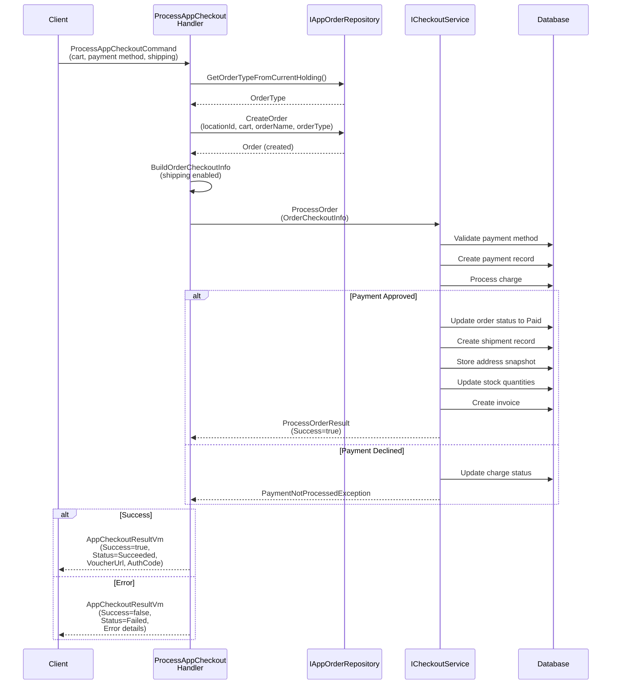
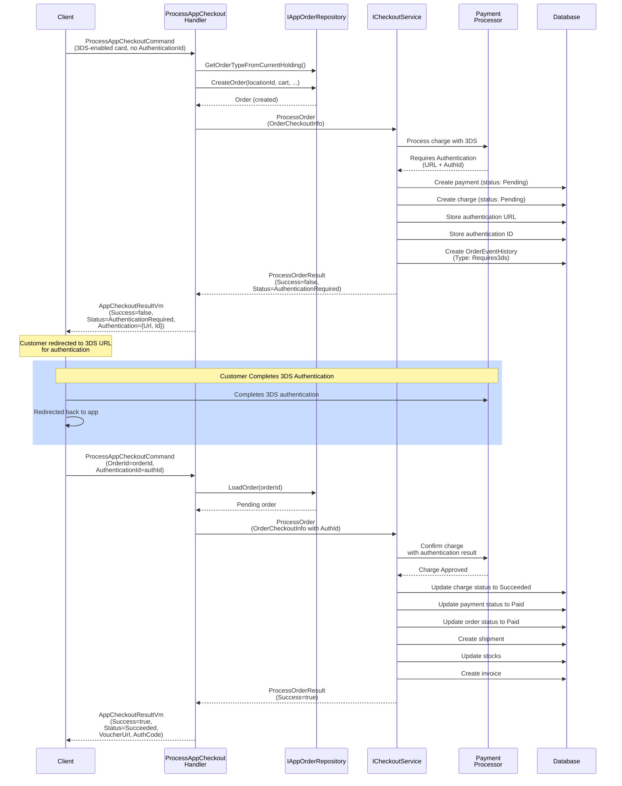
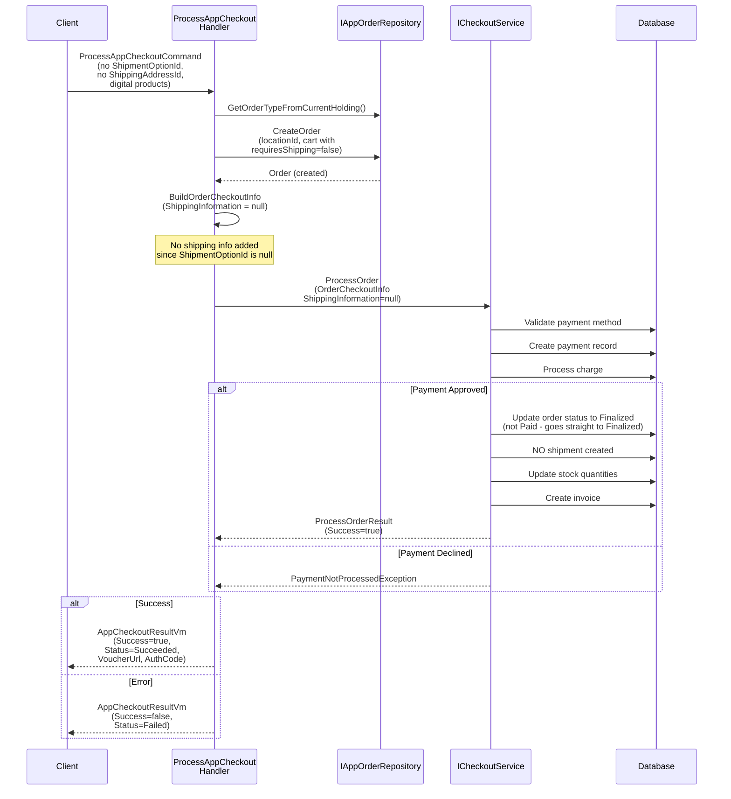

# ProcessAppCheckout Documentation

## Overview

`ProcessAppCheckout` is a CQRS command handler that processes an application checkout flow in the Hugo4Business platform. It orchestrates the creation of orders, initialization of payment processing, and handles various checkout scenarios including regular payments, 3D Secure (3DS) authentication, and products that don't require shipping.

The command is defined in the `ProcessAppCheckoutCommand` class and implements the `IRequest<AppCheckoutResultVm>` interface using MediatR.

## Key Responsibilities

1. **Order Creation**: Creates an order from the shopping cart with specified products and quantities
2. **Payment Processing**: Initiates payment processing through various payment options
3. **Shipping Handling**: Manages shipping information for products that require it
4. **3DS Authentication**: Handles 3D Secure authentication flow when required
5. **Invoice Management**: Manages invoicing information for the order
6. **Proof of Payment**: Handles proof of payment attachments for cash-based payments

## Command Input Parameters

| Parameter                        | Type                  | Description                                       | Required    |
| -------------------------------- | --------------------- | ------------------------------------------------- | ----------- |
| `StoreId`                        | int                   | The store identifier                              | Yes         |
| `LocationId`                     | int                   | The location where the order is placed            | Yes         |
| `BuyerEmail`                     | string                | Buyer's email address                             | Yes         |
| `BuyerName`                      | string                | Buyer's full name                                 | Yes         |
| `PaymentOptionId`                | int                   | Selected payment option (Credit Card, Cash, etc.) | Yes         |
| `PaymentMethodId`                | int?                  | Specific payment method (tokenized card, etc.)    | Conditional |
| `ShipmentOptionId`               | int?                  | Shipment option (CoreLogistics, Courier, etc.)    | Conditional |
| `ShippingAddressId`              | int?                  | Buyer's shipping address                          | Conditional |
| `CartDetail`                     | CheckoutCartDetailDto | Cart items with expected totals                   | Yes         |
| `OrderId`                        | int?                  | For retrying pending orders                       | Conditional |
| `AuthenticationId`               | string                | 3DS authentication ID (for resuming 3DS flow)     | Conditional |
| `VerificationCode`               | string                | Card verification code (CVV)                      | Conditional |
| `CashToCollect`                  | decimal?              | Cash amount to collect                            | Conditional |
| `Tip`                            | decimal?              | Tip amount                                        | Conditional |
| `DriverTip`                      | decimal?              | Driver tip amount                                 | Conditional |
| `InvoiceName`                    | string                | Invoice recipient name                            | Conditional |
| `Nit`                            | string                | Tax identification number                         | Conditional |
| `InvoiceAddress`                 | string                | Invoice address                                   | Conditional |
| `InvoiceInfoId`                  | int?                  | Reference to existing invoice info                | Conditional |
| `DeliveryQuoteId`                | int?                  | Delivery quote identifier                         | Conditional |
| `CustomerSessionId`              | int?                  | Customer session identifier                       | Conditional |
| `DeviceId`                       | string                | Device identifier for tracking                    | Conditional |
| `ProofOfPaymentBase64Attachment` | string                | Base64 encoded proof of payment                   | Conditional |
| `ProofOfPaymentProviderCode`     | string                | Payment provider code                             | Conditional |
| `BillingInfo`                    | BillingInfoDto        | Billing information for payments                  | Conditional |
| `CheckoutNote`                   | string                | Custom checkout note                              | Optional    |
| `OrderName`                      | string                | Custom order name                                 | Optional    |
| `OrderReservationDateTime`       | DateTime?             | Reservation time for scheduled orders             | Conditional |
| `DeliveryLocationId`             | int?                  | Delivery location identifier                      | Conditional |

## Command Output

The command returns an `AppCheckoutResultVm` object with the following properties:

```csharp
public class AppCheckoutResultVm
{
    public int OrderId { get; set; }                          // Created order ID
    public bool Success { get; set; }                         // Whether checkout succeeded
    public string Message { get; set; }                       // Result message
    public string VoucherUrl { get; set; }                    // Voucher/receipt URL
    public string AuthorizationCode { get; set; }             // Payment authorization code
    public CheckoutAuthenticationResult Authentication { get; set; }  // 3DS auth details
    public ProcessOrderResultStatus Status { get; set; }      // Final order status
    public CheckoutError Error { get; set; }                  // Error details if failed
}
```

### Response Status Values

- **`Succeeded`**: Payment processed successfully, order is finalized
- **`AuthenticationRequired`**: 3DS authentication needed, order is pending
- **`Failed`**: Payment failed or validation error occurred

---

## Flow 1: Standard Credit Card Checkout with Shipping

This is the most common scenario where a buyer purchases products that require shipping using a credit card payment method.

### Sequence Diagram



### Key Processing Steps

1. **Order Retrieval/Creation**

   - Retrieves the order type based on current holding
   - Creates a new order with the provided cart items
   - Associates the order with the specified location

2. **Checkout Information Building**

   - Shipping information is included since `ShipmentOptionId` is provided
   - Creates shipment details with address and delivery options
   - Includes payment method details

3. **Payment Processing**

   - Validates the payment method exists and belongs to the buyer
   - Processes the credit card charge through the payment processor
   - Creates charge record with processor details (sequential number, reference ID, etc.)

4. **Post-Payment Actions** (if payment succeeds)
   - Order status changed to `Paid`
   - Shipment record created with address snapshot
   - Stock quantities decremented from inventory
   - Invoice record created with buyer information
   - Product availability updated

### Success Scenario

```
Request:
{
  "StoreId": 1,
  "LocationId": 5,
  "BuyerEmail": "buyer@email.com",
  "BuyerName": "John Doe",
  "PaymentOptionId": 1,              // Credit Card
  "PaymentMethodId": 123,             // Tokenized card
  "ShipmentOptionId": 2,              // CoreLogistics
  "ShippingAddressId": 45,
  "CartDetail": {
    "Cart": [
      { "ProductId": 10, "Quantity": 2 },
      { "ProductId": 11, "Quantity": 1 }
    ],
    "ExpectedTotal": 500.00,
    "ExpectedSavedTotal": 50.00
  },
  "VerificationCode": "123",
  "DeviceId": "device-abc123"
}

Response:
{
  "OrderId": 9876,
  "Success": true,
  "Status": "Succeeded",
  "Message": "Order processed successfully",
  "VoucherUrl": "https://example.com/voucher/9876",
  "AuthorizationCode": "AUTH-12345-ABCDE",
  "Authentication": null,
  "Error": null
}

Database Changes:
- Order status: Pending → Paid
- Payment: Created with status Paid
- Charge: Created with status Succeeded
- Shipment: Created with address snapshot
- Product stocks: Decremented
- Invoice: Created with buyer info
```

---

## Flow 2: 3D Secure (3DS) Authentication Flow

This flow handles credit card transactions that require 3D Secure authentication (Strong Customer Authentication). It's a two-stage process: first requesting authentication, then completing the payment after authentication.

### Sequence Diagram



### Stage 1: Initial Request (3DS Challenge Required)

The client initiates a checkout with a 3DS-enabled card without an authentication ID.

```
Request (Stage 1):
{
  "StoreId": 1,
  "LocationId": 5,
  "BuyerEmail": "buyer@email.com",
  "BuyerName": "Jane Doe",
  "PaymentOptionId": 1,              // Credit Card
  "PaymentMethodId": 456,             // 3DS-enabled card
  "ShipmentOptionId": 2,
  "ShippingAddressId": 46,
  "CartDetail": { ... },
  "VerificationCode": "456",
  "BillingInfo": {
    "CountryCode": "USA",
    "StateCode": "NC",
    "ZipCode": "28202"
  }
}

Response (Stage 1 - Challenge Required):
{
  "OrderId": 9877,
  "Success": false,
  "Status": "AuthenticationRequired",
  "Message": "3D Secure authentication required",
  "VoucherUrl": null,
  "AuthorizationCode": null,
  "Authentication": {
    "Id": "AUTH-3DS-UUID-12345",
    "Url": "https://payment-processor.com/3ds/AUTH-3DS-UUID-12345"
  },
  "Error": null
}

Database Changes (Stage 1):
- Order created with status: Pending
- Payment created with status: Pending
- Charge created with status: Pending
- Authentication URL and ID stored in charge
- OrderEventHistory entry: Type=Requires3ds
```

### Stage 2: After Authentication (Complete Payment)

After the customer completes 3DS authentication, the client calls the same command again with the OrderId and AuthenticationId.

```
Request (Stage 2):
{
  "StoreId": 1,
  "LocationId": 5,
  "OrderId": 9877,                    // Retry the pending order
  "AuthenticationId": "AUTH-3DS-UUID-12345",  // From authentication
  "BuyerEmail": "buyer@email.com",
  "BuyerName": "Jane Doe",
  "PaymentOptionId": 1,
  "PaymentMethodId": 456,
  "ShipmentOptionId": 2,
  "ShippingAddressId": 46,
  "CartDetail": { ... },
  "VerificationCode": "456"
}

Response (Stage 2 - Success):
{
  "OrderId": 9877,
  "Success": true,
  "Status": "Succeeded",
  "Message": "Order processed successfully after 3DS authentication",
  "VoucherUrl": "https://example.com/voucher/9877",
  "AuthorizationCode": "AUTH-3DS-APPROVED-98765",
  "Authentication": null,
  "Error": null
}

Database Changes (Stage 2):
- Order status: Pending → Paid
- Payment status: Pending → Paid
- Charge status: Pending → Succeeded
- Shipment created with address snapshot
- Product stocks: Decremented
- Invoice created
- OrderEventHistory: Type=3dsAuthenticated (stored in charge.AuthenticationUrl)
```

### Key Differences from Standard Flow

1. **Two-Stage Process**

   - Stage 1: Validates card and returns authentication URL
   - Stage 2: Completes payment after customer authentication

2. **Pending Order State**

   - Order remains in `Pending` status during authentication
   - Not visible in buyer's order list until paid

3. **Authentication Storage**

   - Authentication URL and ID stored in charge record
   - Used to track authentication flow and state

4. **Business Rules**
   - Buyer can only see orders after payment is completed
   - Cannot retry with same order if not using 3DS
   - Authentication ID required in Stage 2 for security

---

## Flow 3: Product Purchase Without Shipping (requiresShipping = false)

This flow handles purchases of digital products, services, or items that don't require physical shipping. No shipping information is collected or processed.

### Sequence Diagram



### Key Processing Steps

1. **Command Validation**

   - `ShipmentOptionId` is NOT provided (null)
   - `ShippingAddressId` is NOT required (null)
   - Cart contains only products with `requiresShipping = false`

2. **Checkout Information Building**

   - `ShippingInformation` is set to `null` in `OrderCheckoutInfo`
   - No shipping-related validations are performed

3. **Payment Processing**

   - Same as regular flow: validates payment method and processes charge
   - Creates payment and charge records

4. **Post-Payment Actions** (if payment succeeds)
   - Order status goes directly to `Finalized` (not `Paid`)
   - **NO shipment record is created**
   - Stock quantities are decremented
   - Invoice is created with buyer information
   - Order is immediately visible in buyer's order list

### Success Scenario

```
Request:
{
  "StoreId": 1,
  "LocationId": 5,
  "BuyerEmail": "buyer@email.com",
  "BuyerName": "John Doe",
  "PaymentOptionId": 1,              // Credit Card
  "PaymentMethodId": 123,
  "ShipmentOptionId": null,          // NO SHIPPING
  "ShippingAddressId": null,         // NO SHIPPING ADDRESS
  "CartDetail": {
    "Cart": [
      { "ProductId": 50, "Quantity": 1 }  // Digital product (requiresShipping=false)
    ],
    "ExpectedTotal": 100.00,
    "ExpectedSavedTotal": 10.00
  },
  "VerificationCode": "123",
  "DeviceId": "device-xyz789"
}

Response:
{
  "OrderId": 9878,
  "Success": true,
  "Status": "Succeeded",
  "Message": "Order processed successfully",
  "VoucherUrl": "https://example.com/voucher/9878",
  "AuthorizationCode": "AUTH-99999-DIGITAL",
  "Authentication": null,
  "Error": null
}

Database Changes:
- Order created with status: Finalized (not Paid)
- Payment: Created with status Paid
- Charge: Created with status Succeeded
- Shipment: NOT created
- Product stocks: Decremented
- Invoice: Created with buyer info
- Order immediately visible in buyer orders list
```

### Key Differences from Standard Flow

1. **No Shipping Information**

   - Shipping address validation is skipped
   - No shipment record created in database

2. **Order Status**

   - Goes directly to `Finalized` status (not `Paid`)
   - Indicates no further fulfillment is needed

3. **User Experience**

   - Order appears in buyer's order list immediately
   - No shipping tracking needed
   - Instant fulfillment (digital delivery if applicable)

4. **Validation**
   - No delivery quote required
   - No operation zone validation
   - No shipment option validation

---

## Core Components

### ProcessAppCheckoutCommand Handler

**Location**: `src/Application/App/Checkout/Commands/ProcessAppCheckout/ProcessAppCheckoutCommand.cs`

The main handler implements the CQRS command pattern and orchestrates the checkout flow:

```csharp
public class ProcessAppCheckoutCommandHandler : IRequestHandler<ProcessAppCheckoutCommand, AppCheckoutResultVm>
{
    private readonly ICheckoutService _checkoutService;
    private readonly IAppOrderRepository _appOrderRepository;
    private readonly CheckoutUtils _checkoutUtils;

    public async Task<AppCheckoutResultVm> Handle(ProcessAppCheckoutCommand request, CancellationToken cancellationToken)
    {
        // 1. Get order type from current holding
        var orderType = await _appOrderRepository.GetOrderTypeFromCurrentHolding();

        // 2. Create order with cart items
        var order = await _appOrderRepository.CreateOrder(
            request.LocationId,
            request.CartDetail.Cart,
            request.OrderName,
            orderType,
            request.OrderId);

        // 3. Get proof of payment attachment URL
        var attachmentUrl = await _checkoutUtils.GetProofOfPaymentAttachmentUrl(
            request.ProofOfPaymentBase64Attachment,
            order.OrderId,
            request.StoreId);

        // 4. Get invoicing information
        var invoicingInformation = await GetInvoicingInformation(request);

        // 5. Get delivery quote ID
        var deliveryQuoteId = request.DeliveryQuoteId ??
            await _checkoutUtils.GetDeliveryQuoteIdFromSession(request.CustomerSessionId);

        // 6. Build OrderCheckoutInfo
        var checkoutInfo = new OrderCheckoutInfo
        {
            OrderId = order.OrderId,
            BuyerEmail = request.BuyerEmail,
            BuyerName = request.BuyerName,
            PaymentMethodId = request.PaymentMethodId,
            PaymentOptionId = request.PaymentOptionId,
            ShippingInformation = request.ShipmentOptionId != null ? new ShippingInfo { ... } : null,
            CheckoutNote = request.CheckoutNote,
            AuthenticationId = request.AuthenticationId,
            BillingInfo = request.BillingInfo,
            // ... other properties
        };

        // 7. Process the order
        try
        {
            var result = await _checkoutService.ProcessOrder(checkoutInfo);
            return new AppCheckoutResultVm { ... };
        }
        catch (PaymentNotProcessedException ex)
        {
            return new AppCheckoutResultVm { Success = false, ... };
        }
    }

    private async Task<InvoiceInfo> GetInvoicingInformation(ProcessAppCheckoutCommand request)
    {
        if (request.InvoiceInfoId is not null)
        {
            return await _checkoutUtils.GetInvoicingInformation(request.InvoiceInfoId);
        }
        else if (!string.IsNullOrEmpty(request.InvoiceName) && !string.IsNullOrEmpty(request.Nit))
        {
            return new InvoiceInfo
            {
                InvoiceName = request.InvoiceName,
                InvoiceAddress = request.InvoiceAddress,
                Nit = request.Nit,
            };
        }
        return null;
    }
}
```

### ICheckoutService

**Location**: `src/Application/Common/ClientLink/ICheckoutService.cs`

This service handles the actual order processing:

```csharp
public interface ICheckoutService
{
    /// <summary>
    /// Processes an order with checkout information
    /// Returns ProcessOrderResult with Success, Message, VoucherUrl, etc.
    /// Throws PaymentNotProcessedException if payment fails
    /// </summary>
    Task<ProcessOrderResult> ProcessOrder(OrderCheckoutInfo request);

    /// <summary>
    /// Creates/processes the order and buyer (internal)
    /// </summary>
    Task<(Domain.Entities.Order, Domain.Entities.Buyer)> ProcessCheckout(OrderCheckoutInfo request);

    /// <summary>
    /// Runs post-checkout actions (notifications, analytics, etc.)
    /// </summary>
    Task RunPostCheckoutActions(Domain.Entities.Order order, Domain.Entities.Buyer buyer);
}
```

---

## Error Handling

### Exception Types

The handler catches `PaymentNotProcessedException` and converts it to a failed checkout response:

```csharp
try
{
    var result = await _checkoutService.ProcessOrder(checkoutInfo);
    // Return success response...
}
catch (PaymentNotProcessedException ex)
{
    return new AppCheckoutResultVm
    {
        OrderId = order.OrderId,
        Success = false,
        Message = ex.Message,
        Status = ProcessOrderResultStatus.Failed,
        Error = new CheckoutError(ex),
    };
}
```

### Validation Errors

The `ProcessAppCheckoutCommandValidator` validates the command before execution:

```csharp
public class ProcessAppCheckoutCommandValidator : AbstractValidator<ProcessAppCheckoutCommand>
{
    // Validation rules:
    // - Store must be valid
    // - Location must be valid
    // - Cart must not be null/empty
    // - Payment option must be valid
    // - Shipping address required if ShipmentOptionId is provided
    // - Verification code required for certain payment methods
    // - Expected totals must match
    // - etc.
}
```

### Common Validation Failures

1. **Invalid Cart**

   - Cart is null or empty
   - Products don't exist or are unavailable

2. **Invalid Store/Location**

   - Store is not found or inactive
   - Location is closed (unless accepting scheduled orders)

3. **Invalid Payment**

   - Payment method doesn't belong to buyer
   - Verification code missing for non-tokenized cards

4. **Invalid Shipping**

   - Shipping address not found
   - Shipment option doesn't exist
   - Shipping address not in operation zone

5. **Insufficient Stock**
   - Product quantity not available
   - Product modifiers stock exhausted

---

## Data Flow Summary

### Database Changes on Success

```
Order Table:
  - Create new order with status: Pending/Finalized
  - Update status to: Paid (with shipping) or Finalized (no shipping)

Payment Table:
  - Create payment record with status: Pending → Paid
  - Link to order and payment method

Charge Table:
  - Create charge with status: Pending → Succeeded
  - Store processor details (authorization code, reference ID, etc.)

Shipment Table:
  - Create shipment (only if ShippingInformation provided)
  - Store address snapshot as JSON

BuyerShipmentAddress Table:
  - Not modified (snapshot stored in Shipment.JsonShipmentAddress)

Product Stock:
  - Decrement stock quantities

Invoice Table:
  - Create invoice with buyer/NIT information

OrderEventHistory Table:
  - Create event entry for payment processing
  - Create event entry for 3DS if applicable
```

### Database Changes on Failure

```
Order Table:
  - Order remains in Pending status
  - Can be retried with same OrderId

Payment Table:
  - Payment remains in Pending status

Charge Table:
  - Charge status: Failed
  - Error details stored

Stock/Invoice:
  - NOT modified (transaction-like behavior)
```

---

## Integration Points

### Dependencies

1. **ICheckoutService**: Core order processing service
2. **IAppOrderRepository**: Order creation and retrieval
3. **CheckoutUtils**: Utility functions for attachments, invoicing, delivery quotes
4. **IAppAccessService**: (Mocked in tests) Application access control
5. **IGeolocationService**: (Mocked in tests) Address validation
6. **ITerritoryAccessService**: (Mocked in tests) Territory access control

### Related Commands/Queries

- **GetAppCheckoutInfoQuery**: Retrieves cart details before checkout
- **GetAppCheckoutSessionQuery**: Gets customer session details
- **CreateDeliveryQuote**: Creates delivery quotes for shipping
- **ChangeShipmentStatus**: Updates shipment status post-checkout
- **ReserveOrder**: Reserves orders for scheduled purchases

---

## Test Cases Overview

The `ProcessAppCheckoutTests` class covers various scenarios:

### Payment Type Tests

- ✅ `CreditCardOrderTest` - Standard credit card payment
- ✅ `CashPaymentTest` - Cash-on-delivery payment
- ✅ `ProofOfPaymentOrderTest` - Proof of payment (receipt) based payment
- ✅ `CreditsOrderTest` - Store credit payment
- ✅ `MerchantCashPaymentTest` - Merchant cash collection

### 3DS Authentication Tests

- ✅ `ShouldProcessAProductOrderUsing3ds` - Complete 3DS flow
- ✅ `ShouldRequireValid3dsAuthenticationId` - Validation of 3DS ID
- ✅ `ShouldRefresh3dsAuthUrl` - URL refresh mechanism
- ✅ `ShouldFailWhenPaymentMethodRequiresBillingInfoOn3dsSetup` - Billing info validation

### Shipping Tests

- ✅ `CheckoutWithoutShippingTest` - No shipping required
- ✅ `ShouldNotRequireAddressForPickup` - Pickup orders
- ✅ `ShouldCreateShipmentEvenForPickupOrders` - Shipment tracking for pickup
- ✅ `CourierCheckoutTest` - Third-party courier shipping

### Validation Tests

- ✅ `ShouldValidateTheLocationAgainstOrderStore` - Location validation
- ✅ `ShouldValidateThePaymentMethodAgainstTheBuyer` - Payment method ownership
- ✅ `ShouldValidateShippingAddress` - Address existence
- ✅ `ShouldValidateShipmentOption` - Option availability
- ✅ `ShouldValidateStockPreCheckout` - Stock availability

### Stock & Pricing Tests

- ✅ `ShouldNotDiscountOfProductsConfiguredWithNoStock` - No-stock handling
- ✅ `ShouldCheckoutWithActivePromoPrices` - Promotional discounts
- ✅ `ShouldApplyPromoPricesToOrder` - Price application
- ✅ `ShouldCheckoutAnOrderWithSurcharges` - Surcharge handling

### Order State Tests

- ✅ `ShouldCheckoutAPendingOrder` - Retry pending orders
- ✅ `ShouldValidationFailIfTheOrderDoesNotExist` - Order existence
- ✅ `ShouldValidationFailIfTheOrderHasExpired` - Order expiration
- ✅ `ShouldNotCheckoutAPaidOrderTwice` - Double-payment prevention

### Advanced Features

- ✅ `ShouldCheckoutAScheduledOrder` - Scheduled/reserved orders
- ✅ `ShouldSaveTheOrderName` - Custom order naming
- ✅ `ShouldCheckoutAnOrderWithCustomDeliveryCost` - Custom delivery costs
- ✅ `ShouldCheckoutAnOrderWithTip` - Tip handling
- ✅ `ShouldSaveInvoicingInfo` - Invoice information storage

---

## Best Practices

### For Clients Calling ProcessAppCheckout

1. **Always call GetAppCheckoutInfoQuery first**

   - Validates cart and gets expected totals
   - Returns exact prices, discounts, and fees

2. **Store the expected totals**

   - Use these values in `CheckoutCartDetailDto`
   - System validates to prevent tampering

3. **Handle 3DS flow properly**

   - Check response `Status` for `AuthenticationRequired`
   - Redirect customer to `Authentication.Url`
   - Retry with `OrderId` and `AuthenticationId` after completion

4. **Validate shipping requirements**

   - Only provide `ShipmentOptionId`/`ShippingAddressId` if cart requires shipping
   - Skip these for digital products

5. **Implement proper error handling**
   - Log the `CheckoutError` details
   - Show user-friendly error messages
   - Allow retry for failed payments

### For Developers Extending ProcessAppCheckout

1. **Keep business logic in CheckoutService**

   - Handler should be thin orchestration only
   - Avoid putting validation/processing logic in the handler

2. **Validate at the boundary**

   - Use ProcessAppCheckoutCommandValidator
   - Catch exceptions and convert to appropriate responses

3. **Store payment processor details**

   - Always log authorization codes and references
   - Help with debugging and reconciliation

4. **Test all paths**
   - Success path
   - Failure path (PaymentNotProcessedException)
   - Validation failure path (FluentValidation)

---

## Additional Resources

### Related Files

- `ProcessAppCheckoutCommand.cs` - Command definition and handler
- `ProcessAppCheckoutCommandValidator.cs` - Input validation
- `AppCheckoutResultVm.cs` - Response model
- `CheckoutCartDetailDto.cs` - Cart data transfer object
- `ProcessAppCheckoutTests.cs` - Comprehensive test cases

### Configuration

- Payment options configured in database
- Shipment options configured per store
- 3DS settings per store (`Store.Is3dsEnabled`)

### API Endpoints

The command is typically called through a REST API endpoint (e.g., `POST /api/checkout/process-app-checkout`) that maps the request to this command via MediatR.
